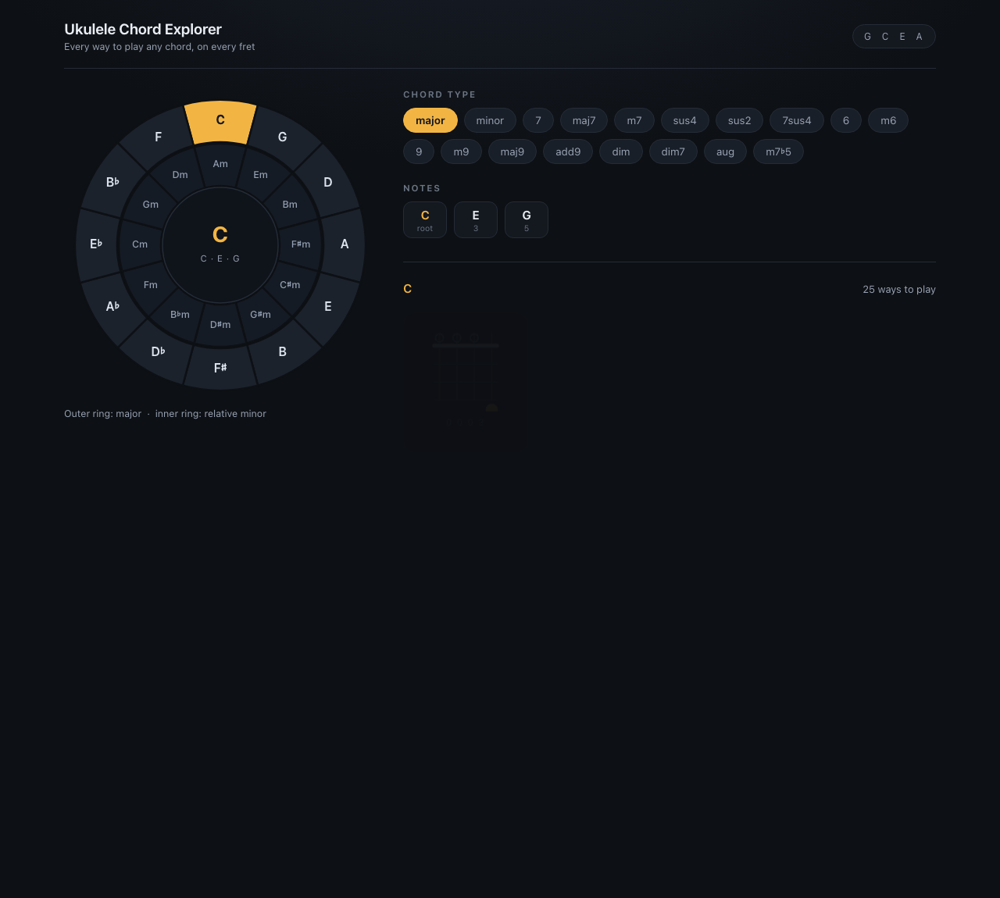

# Ukulele Chord Explorer

[](https://github.com/onur-gunes/Ukulele-Chord-Explorer/actions/workflows/deploy-pages.yml)



Every way to play any chord, on every fret — in a single HTML file.

Pick a root on the circle of fifths, pick a chord type, and get every playable
voicing drawn as a real chord diagram, ordered from easiest to hardest. There's
also a reverse lookup: type a fret shape and the app tells you what chord it is.

## Features

- Interactive circle of fifths (major outer ring, minor inner ring), fully
  keyboard navigable with ARIA labels
- 18 chord types — major, minor, 7, maj7, m7, sus2, sus4, 7sus4, 6, m6, 9, m9,
  maj9, add9, dim, dim7, aug, m7♭5
- Voicings brute-force searched across frets 0–12, filtered by playability
  (finger span, barre rules, open-string constraints), then sorted by finger
  count and position
- Chord tone breakdown with intervals, root highlighted
- Reverse "what is this shape?" finder
- No dependencies, no build step — one self-contained `index.html`
- Responsive, dark themed

## Run it

Open `index.html` in a browser, or serve the folder:

```sh
python3 -m http.server 8000
```

## Tests

Headless harness — extracts the app's script, runs it against a fake DOM, and
asserts rendering, diagram geometry, the finder tool, and chip grouping.
macOS only (JXA via `osascript`):

```sh
osascript -l JavaScript tests/harness.js
```

`tests/*.html` are self-contained browser checks — open one and read the
output it prints.

The standalone prototype of the chord shape search lives in `dev/`:

```sh
python3 dev/chordtest.py
```

## Structure

```
index.html                  the app: markup, styles and logic in one file
tests/harness.js            headless test harness (fake DOM + assertions)
tests/*.html                in-browser test pages
dev/chordtest.py|.js        earlier prototype of the shape finder
shots/desktop.png           screenshot
.github/workflows/          GitHub Pages deploy workflow
```

## Deployment

Pushing to `main` runs `.github/workflows/deploy-pages.yml`, which publishes
`index.html` to GitHub Pages. If Pages isn't active yet, set
**Settings → Pages → Source: GitHub Actions**.
